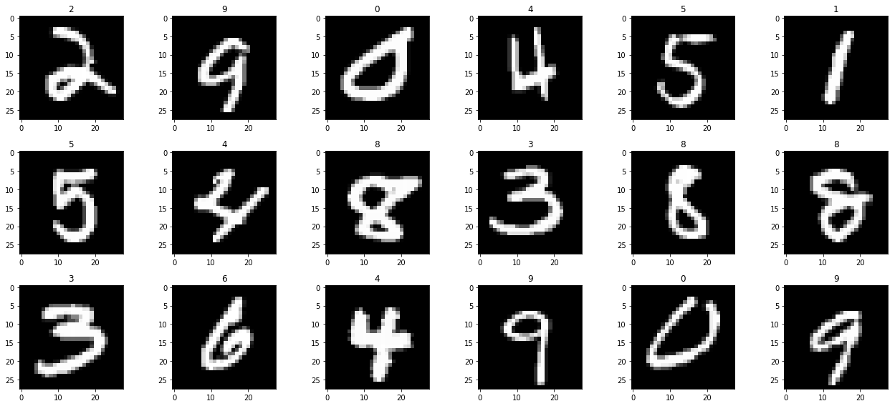

```python
import numpy as np
import pandas as pd
import matplotlib.pyplot as plt
import seaborn as sns
import tensorflow as tf
import random
import os
print('setup is complete')
```

    setup is complete


```python
test_dataset = pd.read_csv("../input/digit-recognizer/test.csv")
train_dataset = pd.read_csv("../input/digit-recognizer/train.csv")
print('datasets are ready')
```

    datasets are ready


```python
plt.figure(figsize=(18, 8))
sample_image = train_dataset.sample(18).reset_index(drop=True)
for index, row in sample_image.iterrows():
    label = row['label']
    image_pixels = row.drop('label')
    plt.subplot(3, 6, index+1)
    plt.imshow(image_pixels.values.reshape(28,28), cmap=plt.cm.gray)
    plt.title(label)
plt.tight_layout()
```





```python
from sklearn.model_selection import train_test_split
from keras.utils import to_categorical

x = train_dataset.drop(columns=['label']).values.reshape(train_dataset.shape[0],28,28,1)
y = to_categorical(train_dataset['label'])
x_train, x_test, y_train, y_test = train_test_split(x, y, test_size=0.1)
```


```python
from keras.preprocessing.image import ImageDataGenerator
batch_size=32
train_datagen = ImageDataGenerator(
    rotation_range=10,
    rescale=1./255,
    shear_range=0.1,
    zoom_range=0.1,
    width_shift_range=0.1,
    height_shift_range=0.1
)

train_datagen.fit(x_train)
train_generator = train_datagen.flow(
    x_train,
    y_train,
    batch_size=batch_size
)

validation_datagen = ImageDataGenerator(rescale=1./255)
train_datagen.fit(x_test)
validation_generator = validation_datagen.flow(
    x_test,
    y_test
    
)
```


```python
from keras.models import Sequential
from keras.layers import Dense, Conv2D, Flatten, MaxPooling2D

model = Sequential()
model.add(Conv2D(64, kernel_size=3, activation='relu', input_shape=(28,28,1)))
model.add(Conv2D(32, kernel_size=3, activation='relu'))
model.add(MaxPooling2D(pool_size=(2, 2)))
model.add(Flatten())
model.add(Dense(10, activation='softmax'))
model.summary()
```

    Model: "sequential_2"
    _________________________________________________________________
    Layer (type)                 Output Shape              Param #   
    =================================================================
    conv2d_3 (Conv2D)            (None, 26, 26, 64)        640       
    _________________________________________________________________
    conv2d_4 (Conv2D)            (None, 24, 24, 32)        18464     
    _________________________________________________________________
    max_pooling2d_2 (MaxPooling2 (None, 12, 12, 32)        0         
    _________________________________________________________________
    flatten_2 (Flatten)          (None, 4608)              0         
    _________________________________________________________________
    dense_2 (Dense)              (None, 10)                46090     
    =================================================================
    Total params: 65,194
    Trainable params: 65,194
    Non-trainable params: 0
    _________________________________________________________________


```python
model.compile(optimizer='rmsprop', loss='categorical_crossentropy', metrics=['accuracy'])
```


```python
from keras.callbacks import EarlyStopping, ModelCheckpoint, ReduceLROnPlateau

callbacks = [
    EarlyStopping(patience=10, verbose=1),
    ReduceLROnPlateau(factor=0.1, patience=3, min_lr=0.00001, verbose=1),
    ModelCheckpoint('model.h5', verbose=1, save_best_only=True, save_weights_only=True)
]
```


```python
model.fit_generator(
    train_generator, 
    steps_per_epoch=len(x_train) // batch_size, 
    validation_data=validation_generator,
    validation_steps=len(x_test) // batch_size,
    epochs=150,
    callbacks=callbacks
)
```

    Epoch 1/150
    1181/1181 [==============================] - 18s 16ms/step - loss: 0.2275 - accuracy: 0.9327 - val_loss: 0.0531 - val_accuracy: 0.9752
    
    Epoch 00001: val_loss improved from inf to 0.05314, saving model to model.h5
    Epoch 2/150
    1181/1181 [==============================] - 17s 14ms/step - loss: 0.1485 - accuracy: 0.9557 - val_loss: 0.0119 - val_accuracy: 0.9801
    
    Epoch 00002: val_loss improved from 0.05314 to 0.01186, saving model to model.h5
    Epoch 3/150
    1181/1181 [==============================] - 17s 14ms/step - loss: 0.1158 - accuracy: 0.9654 - val_loss: 0.0091 - val_accuracy: 0.9856
    
    Epoch 00003: val_loss improved from 0.01186 to 0.00906, saving model to model.h5
    Epoch 4/150
    1181/1181 [==============================] - 18s 15ms/step - loss: 0.1045 - accuracy: 0.9693 - val_loss: 0.0875 - val_accuracy: 0.9846
    
    Epoch 00004: val_loss did not improve from 0.00906
    Epoch 5/150
    1181/1181 [==============================] - 18s 15ms/step - loss: 0.0995 - accuracy: 0.9711 - val_loss: 0.0473 - val_accuracy: 0.9858
    
    Epoch 00005: val_loss did not improve from 0.00906
    Epoch 6/150
    1181/1181 [==============================] - 17s 15ms/step - loss: 0.0927 - accuracy: 0.9719 - val_loss: 0.2075 - val_accuracy: 0.9834
    
    Epoch 00006: ReduceLROnPlateau reducing learning rate to 0.00010000000474974513.
    
    Epoch 00006: val_loss did not improve from 0.00906
    Epoch 7/150
    1181/1181 [==============================] - 18s 16ms/step - loss: 0.0767 - accuracy: 0.9773 - val_loss: 0.0657 - val_accuracy: 0.9880
    
    Epoch 00007: val_loss did not improve from 0.00906
    Epoch 8/150
    1181/1181 [==============================] - 18s 15ms/step - loss: 0.0760 - accuracy: 0.9771 - val_loss: 0.1879 - val_accuracy: 0.9882
    
    Epoch 00008: val_loss did not improve from 0.00906
    Epoch 9/150
    1181/1181 [==============================] - 17s 15ms/step - loss: 0.0761 - accuracy: 0.9774 - val_loss: 0.0146 - val_accuracy: 0.9880
    
    Epoch 00009: ReduceLROnPlateau reducing learning rate to 1.0000000474974514e-05.
    
    Epoch 00009: val_loss did not improve from 0.00906
    Epoch 10/150
    1181/1181 [==============================] - 17s 15ms/step - loss: 0.0726 - accuracy: 0.9786 - val_loss: 0.0363 - val_accuracy: 0.9892
    
    Epoch 00010: val_loss did not improve from 0.00906
    Epoch 11/150
    1181/1181 [==============================] - 19s 16ms/step - loss: 0.0729 - accuracy: 0.9780 - val_loss: 0.0021 - val_accuracy: 0.9870
    
    Epoch 00011: val_loss improved from 0.00906 to 0.00208, saving model to model.h5
    Epoch 12/150
    1181/1181 [==============================] - 17s 15ms/step - loss: 0.0712 - accuracy: 0.9789 - val_loss: 0.2357 - val_accuracy: 0.9887
    
    Epoch 00012: val_loss did not improve from 0.00208
    Epoch 13/150
    1181/1181 [==============================] - 18s 15ms/step - loss: 0.0744 - accuracy: 0.9782 - val_loss: 0.0258 - val_accuracy: 0.9880
    
    Epoch 00013: val_loss did not improve from 0.00208
    Epoch 14/150
    1181/1181 [==============================] - 18s 15ms/step - loss: 0.0721 - accuracy: 0.9788 - val_loss: 0.0068 - val_accuracy: 0.9870
    
    Epoch 00014: ReduceLROnPlateau reducing learning rate to 1e-05.
    
    Epoch 00014: val_loss did not improve from 0.00208
    Epoch 15/150
    1181/1181 [==============================] - 18s 15ms/step - loss: 0.0737 - accuracy: 0.9778 - val_loss: 8.0507e-04 - val_accuracy: 0.9887
    
    Epoch 00015: val_loss improved from 0.00208 to 0.00081, saving model to model.h5
    Epoch 16/150
    1181/1181 [==============================] - 17s 15ms/step - loss: 0.0738 - accuracy: 0.9782 - val_loss: 0.0019 - val_accuracy: 0.9870
    
    Epoch 00016: val_loss did not improve from 0.00081
    Epoch 17/150
    1181/1181 [==============================] - 17s 15ms/step - loss: 0.0754 - accuracy: 0.9778 - val_loss: 0.0190 - val_accuracy: 0.9894
    
    Epoch 00017: val_loss did not improve from 0.00081
    Epoch 18/150
    1181/1181 [==============================] - 18s 16ms/step - loss: 0.0743 - accuracy: 0.9780 - val_loss: 0.2015 - val_accuracy: 0.9878
    
    Epoch 00018: val_loss did not improve from 0.00081
    Epoch 19/150
    1181/1181 [==============================] - 17s 14ms/step - loss: 0.0710 - accuracy: 0.9787 - val_loss: 0.0014 - val_accuracy: 0.9890
    
    Epoch 00019: val_loss did not improve from 0.00081
    Epoch 20/150
    1181/1181 [==============================] - 18s 15ms/step - loss: 0.0744 - accuracy: 0.9782 - val_loss: 0.0016 - val_accuracy: 0.9861
    
    Epoch 00020: val_loss did not improve from 0.00081
    Epoch 21/150
    1181/1181 [==============================] - 18s 15ms/step - loss: 0.0714 - accuracy: 0.9786 - val_loss: 0.0429 - val_accuracy: 0.9887
    
    Epoch 00021: val_loss did not improve from 0.00081
    Epoch 22/150
    1181/1181 [==============================] - 17s 15ms/step - loss: 0.0704 - accuracy: 0.9796 - val_loss: 0.0025 - val_accuracy: 0.9868
    
    Epoch 00022: val_loss did not improve from 0.00081
    Epoch 23/150
    1181/1181 [==============================] - 17s 14ms/step - loss: 0.0692 - accuracy: 0.9786 - val_loss: 0.0027 - val_accuracy: 0.9880
    
    Epoch 00023: val_loss did not improve from 0.00081
    Epoch 24/150
    1181/1181 [==============================] - 18s 15ms/step - loss: 0.0736 - accuracy: 0.9785 - val_loss: 0.0101 - val_accuracy: 0.9892
    
    Epoch 00024: val_loss did not improve from 0.00081
    Epoch 25/150
    1181/1181 [==============================] - 18s 15ms/step - loss: 0.0706 - accuracy: 0.9787 - val_loss: 0.0011 - val_accuracy: 0.9880
    
    Epoch 00025: val_loss did not improve from 0.00081
    Epoch 00025: early stopping


    <keras.callbacks.callbacks.History at 0x7f18d3071e80>


```python
test_digit_data = test_dataset.values.reshape(test_dataset.shape[0],28,28,1).astype("float32") / 255
predictions = model.predict(test_digit_data)
results = np.argmax(predictions, axis = 1) 
```


```python
plt.figure(figsize=(18, 12))
sample_test = test_dataset.head(30)
for index, image_pixels in sample_test.iterrows():
    label = results[index]
    plt.subplot(5, 6, index+1)
    plt.imshow(image_pixels.values.reshape(28,28), cmap=plt.cm.gray)
    plt.title(label)
plt.tight_layout()
```


